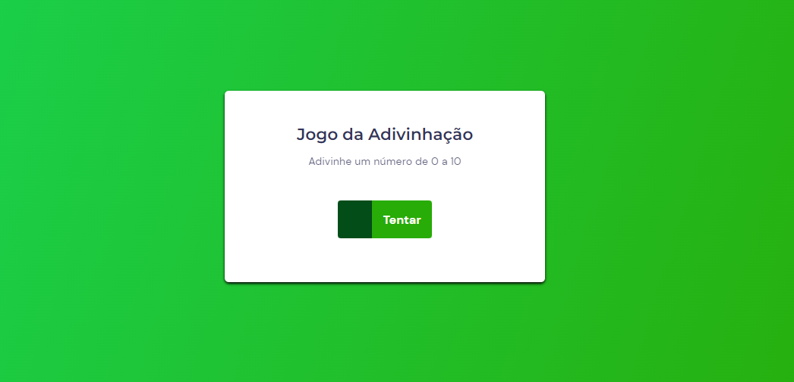

# Jogo da Adivinhação

Esse projeto foi desenvolvido para estudo, no bootcamp da [RocketSeat](https://rocketseat.com.br). Objetivo dele era cria o jogo da adivinhação utilizando HTML, CSS e Javascript, onde o objetivo do jogo é acerta em menos tentativas um número entre 0 a 10.
<h4 align="center"> 
🚀 Em Andamento
</h4>

### 📕 Aprendizados

- Aprendi a utilizar mais o HTML5, CSS3 e Javascript.
- Callbacks, PreventDefault, Manipulação do DOM e Eventos.

### 🏁 Resultado

### 👨‍💻 Baixar projeto

Antes de baixar o código e começar seus estudos, é bom ter um editor para trabalhar com o código como o [VSCode](https://code.visualstudio.com/).
Faça o clone deste repositório usando git clone: https://github.com/jair-araujo/snake-the-game.git pelo seu terminal ou clique em Code/Download ZIP.
Com o arquivo configurado na sua máquina execute o "index.HTML" e veja a jogo funcionando.

### 😉 Link do projeto publicado no GitHub Pages

Para ver como ficou, você pode acessar o link [jogo-da-adivinhacao](https://jair-araujo.github.io/jogo-da-adivinhacao/) e se divertir um pouco.

### 🛠 Tecnologias

As seguintes ferramentas foram usadas na construção do projeto:

### ✏ Autor

Feito com ❤ por Jair Araujo ☕ Entre em contato!

### Todo o layout foi baseado no projeto do Bootcamp Explorer da [RocketSeat](https://rocketseat.com.br)
